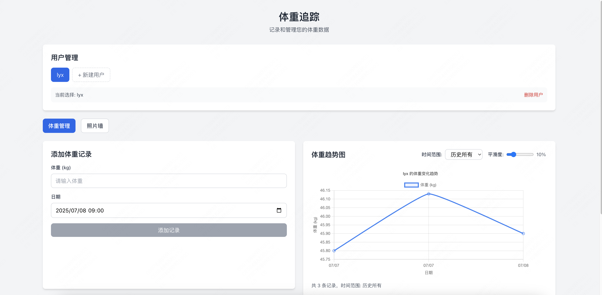

# 体重追踪网站（WeightTrack）

一个前后端分离的体重追踪应用，支持多用户体重管理、数据可视化和照片上传，适合个人或家庭健康管理。



---

## 功能特性

- **多用户支持**：可创建多个用户，独立管理各自体重与照片
- **体重数据录入**：支持按日期添加、修改、删除体重记录
- **体重趋势图表**：可按周/月/年/全部历史查看体重变化曲线，支持平滑度调节
- **照片墙**：为每个用户按日期上传、浏览、下载和删除照片
- **一键Docker部署**：无需本地环境配置

---

## 技术栈

- **后端**：Python 3.10, Flask, Flask-SQLAlchemy, Flask-CORS, SQLite
- **前端**：React 18, TypeScript, Chart.js, Tailwind CSS, Axios
- **容器化**：Docker, Docker Compose

---

## 目录结构

```
WeightTrack/
├── backend/          # Flask后端
│   ├── app.py        # 应用入口
│   ├── models.py     # 数据模型
│   ├── routes.py     # API路由
│   ├── requirements.txt
│   └── Dockerfile
├── frontend/         # React前端
│   ├── src/          # 前端源码
│   ├── public/
│   ├── package.json
│   └── Dockerfile
├── docker-compose.yml
└── README.md
```

---

## 快速开始（推荐Docker方式）

### 1. 安装依赖

请确保已安装 [Docker](https://www.docker.com/) 和 [Docker Compose](https://docs.docker.com/compose/)

### 2. 一键启动

在项目根目录下执行：

```bash
docker-compose up --build -d
```

- 首次运行会自动构建前后端镜像并启动服务
- 前端服务端口：`http://localhost:3000`
- 后端API端口：`http://localhost:5000`

### 3. 关闭服务

```bash
docker-compose down
```

---

## 本地开发（可选）

如需本地调试：

**后端：**
```bash
cd backend
pip install -r requirements.txt
python app.py
```

**前端：**
```bash
cd frontend
npm install
npm start
```
访问 [http://localhost:3000](http://localhost:3000)

---

## 主要API接口说明

| 方法 | 路径 | 说明 |
|------|------|------|
| GET    | /api/users                | 获取所有用户 |
| POST   | /api/users                | 创建新用户（参数：name）|
| DELETE | /api/users/\<id\>           | 删除用户 |
| GET    | /api/users/\<id\>/weight    | 获取用户体重记录（支持 time_range=week/month/year/all）|
| POST   | /api/users/\<id\>/weight    | 添加体重记录（参数：weight, date）|
| PUT    | /api/users/\<id\>/weight/<record_id> | 更新体重记录 |
| DELETE | /api/users/\<id\>/weight/<record_id> | 删除体重记录 |
| POST   | /api/users/\<id\>/photos    | 上传照片（表单参数：file, date）|
| GET    | /api/users/\<id\>/photos    | 获取用户所有照片 |
| GET    | /api/photos/<photo_id>    | 获取单张照片 |
| GET    | /api/photos/<photo_id>/download | 下载照片 |
| DELETE | /api/photos/<photo_id>    | 删除照片 |

---

## 常见问题

1. **数据存储在哪里？**  
   - 所有数据（用户、体重、照片信息）保存在后端 `backend/instance/weight_tracker.db` SQLite数据库中，照片文件保存在 `backend/instance/photos/`。

2. **如何重置数据？**  
   - 停止服务后，删除 `backend/instance/weight_tracker.db` 和 `backend/instance/photos/` 目录即可。

3. **前端如何与后端通信？**  
   - 前端通过 RESTful API 与后端交互，开发环境下已配置代理，生产环境下通过 Docker Compose 自动联通。

4. **如何修改端口？**  
   - 修改 `docker-compose.yml` 中的 `ports` 映射即可。

---

## 贡献与反馈

欢迎提交 Issue 或 PR 改进本项目！

---

如需更详细的API参数、前端页面说明或部署细节，请提交GitHub Issue！ 